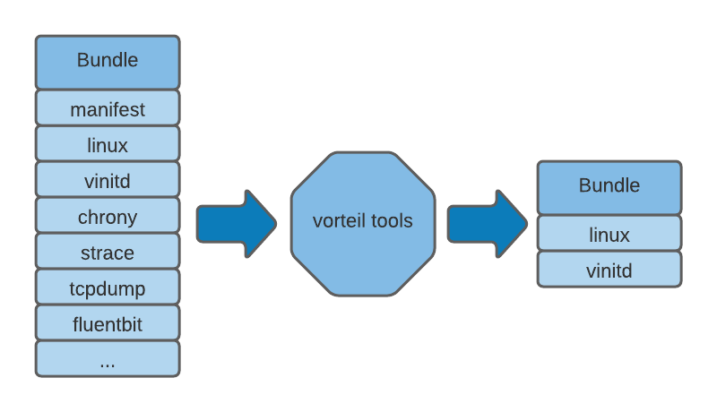
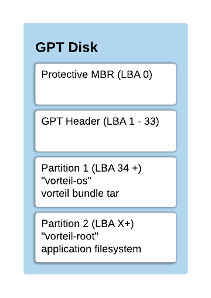

<br />
<p align="center">
  <a href="https://github.com/vorteil/vbundler">
    
  </a>
  <h3 align="center">vbundler</h3>
  <h5 align="center">build system for vorteil.io micro virtual machine bundles</h5>
</p>

<hr/>

Bundlers built from the [vbundler](https://github.com/vorteil/vbundler) project contain dependencies that the [vorteil.io tools](https://github.com/vorteil/vorteil) require in order to build and run a vorteil.io micro VM. The tools extract only the dependencies necessary at build-time. This project builds the bundle with all dependencies from scratch.

## Bundle Layout

The bundle is the base for the first partition of a vorteil.io disk image. It is basically a tar archive with an additional metadata file. The following is a shortened example of this metadata file.

**Metadata file**
```yaml
{
  "version": "1.0.0",
  "files": [
  {
    "name": "vinitd",
    "tags": []
  },
  {
    "name": "strace",
    "tags": []
  },
  {
    "name": "fluent-bit",
    "tags": ["logs"]
  },
  {
    "name": "tcpdump",
    "tags": ["tcp"]
    }
  ]
}
```

The [vorteil.io tools](https://github.com/vorteil/vorteil) select files from a bundle depending on the tags associated with each specific file. For example: if an application configuration uses internal fluentbit logging the tools will pick all items from the bundle that are tagged with "logs" along with other required files (such as vinitd and linux).

**Bundle to disk partition**
<p align="center">
    
</p>

During the disk image build process the manifest file is removed and only the necessary artifacts are picked from the bundle. It is important that linux is the first item in the tar archive. The [bootloader](https://github.com/vorteil/linux-bootloader) loads linux from a fixed offset on the created image.

**Disk Layout**
<p align="center">
    
</p>

The final disk has two partitions. The first one contains the created live bundle and the second partition contains a filesystem generated from the project used to build the image.

The first partition is mounted under _/vorteil_ during boot of the system. The second partition is mounted under _/_.

**Artifacts for builder:**

- [kernel](https://github.com/vorteil/vlinux)
- [vinitd](https://github.com/vorteil/vinitd)
- [chrony](https://chrony.tuxfamily.org/)
- [fluent-bit](https://github.com/fluent/fluent-bit)
- [fluent-bit disk plugin](https://github.com/vorteil/fluent-bit-disk)
- [busybox](https://busybox.net/)
- [strace](https://github.com/vorteil/strace)
- [tcpdump](https://github.com/vorteil/tcpdump)

## Building

Building vbundler is supported on Ubuntu and CentOS systems. Any changes made to [vinitd](https://github.com/vorteil/vinitd) should be made in the vinitd project, and not within vbundler.

To build vbundler, run the following commands (the value of the `BUNDLE_VERSION` environment variable will determine the name of the resulting bundle file):

```
git clone https://github.com/vorteil/vbundler
cd vbundler
make dependencies
BUNDLE_VERSION=20.9.1 make bundle
```

## License

Distributed under the Apache 2.0 License. See `LICENSE` for more information.
